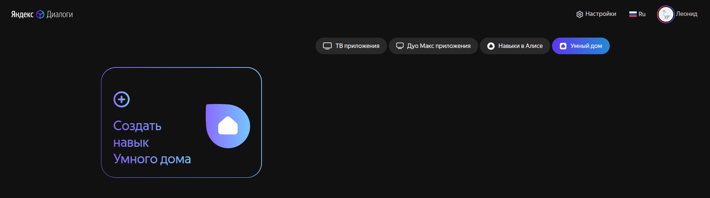
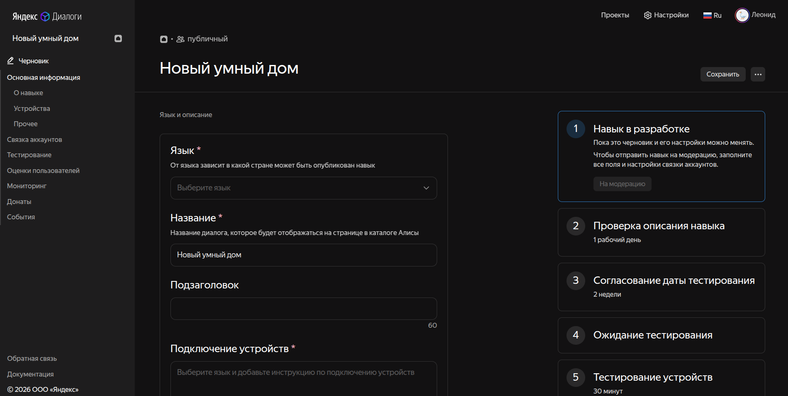

# Настройка навыка Алисы для привязки к умному дому

1. Переходим в [Консоль Яндекс Диалогов (вкладка "Умный дом")](https://dialogs.yandex.ru/developer/smart-home)



2. Нажимаем "Создать навык Умного дома"



3. Задаем настройки

```
- Язык: русский
- Название: <любое>
- Подключение устройств: - (поле обязательное, нужно написать хоть что-то)
- Список поддерживаемых устройств: - (поле обязательное, нужно написать хоть что-то)

- Backend: URL сервера, на котором располжен адаптер (программа из этого репозитория), например https://my-home.example.com
- Тип доступа: приватный 
- Имя разработчика: <ваше имя>
- Иконка: <любая>
```

4. В правом верхнем углу страницы нажимаем "Сохранить"

5. В левом меню выбираем "Связка аккаунтов"