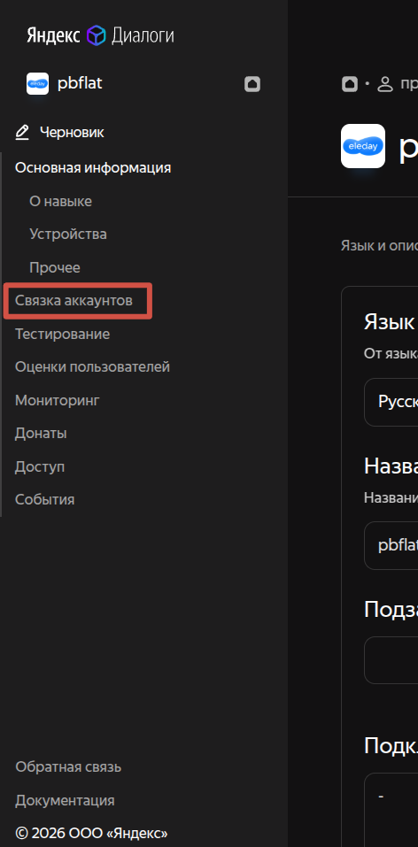
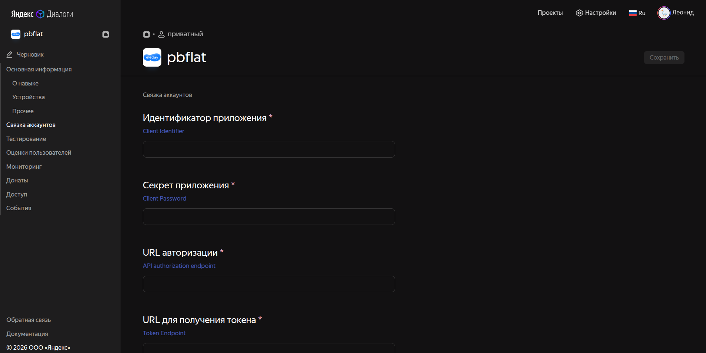

# Настройка навыка Алисы для привязки к умному дому

1. Переходим в [Консоль Яндекс Диалогов (вкладка "Умный дом")](https://dialogs.yandex.ru/developer/smart-home)


2. Нажимаем "Создать навык Умного дома"


3. Задаем настройки

```
- Язык: русский
- Название: <любое>
- Подключение устройств: - (поле обязательное, нужно написать хоть что-то)
- Список поддерживаемых устройств: - (поле обязательное, нужно написать хоть что-то)

- Backend: URL сервера, на котором располжен адаптер (программа из этого репозитория), например https://my-home.example.com
- Тип доступа: приватный 
- Имя разработчика: <ваше имя>
- Иконка: <любая>
```

4. В правом верхнем углу страницы нажимаем "Сохранить"

5. В левом меню выбираем "Связка аккаунтов"



6. Чтобы сгенерировать секреты запускаем файл `generate_env.py`

```bash
python generate_env.py
```

Будет создан файл `.env` с `OAUTH_CLIENT_ID` и `OAUTH_CLIENT_SECRET`

7. Эти секреты нужно ввести на открытой странице



|В настройках УДЯ|Из файла `.env`|
|-|-|
|Идентификатор приложения|`OAUTH_CLIENT_ID`|
|Секрет приложения|`OAUTH_CLIENT_SECRET`|
|URL авторизации|`https://my-home.example.com/authorize`|
|URL для получения токена|`https://my-home.example.com/token`|

Эти значения необходимы для авторизации через OAuth 2 и связки навыка УДЯ и адаптера.